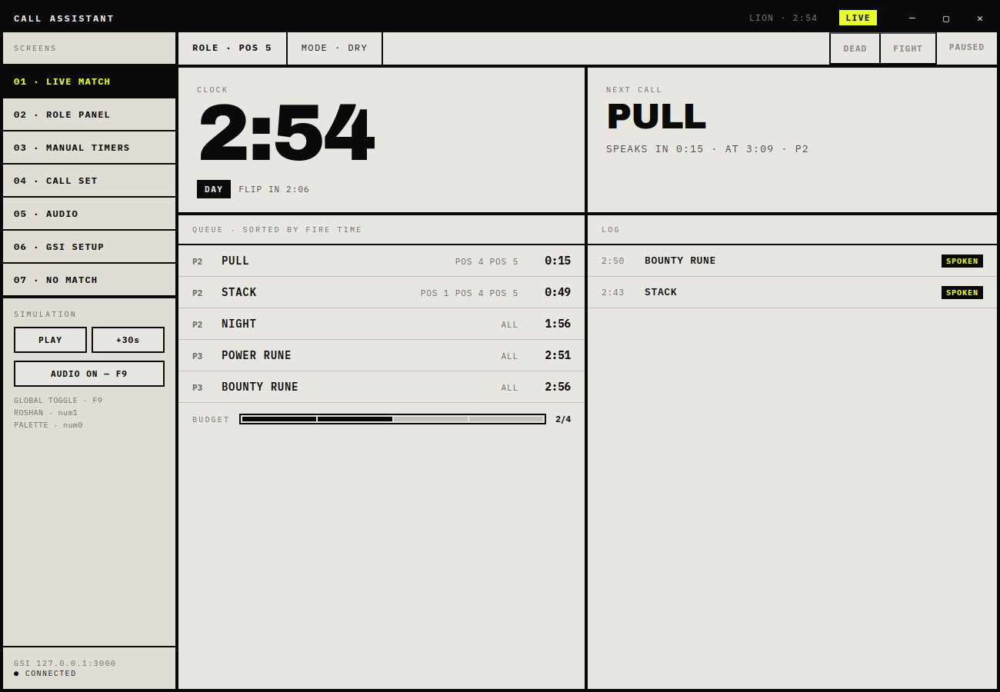
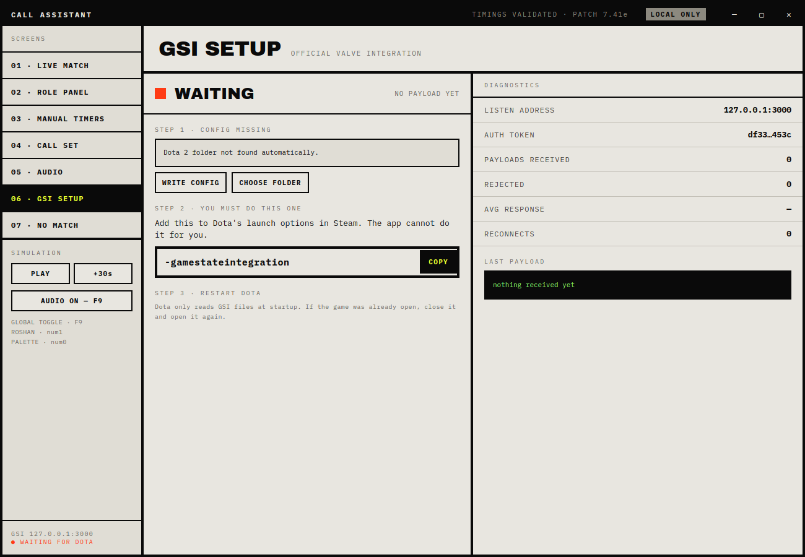
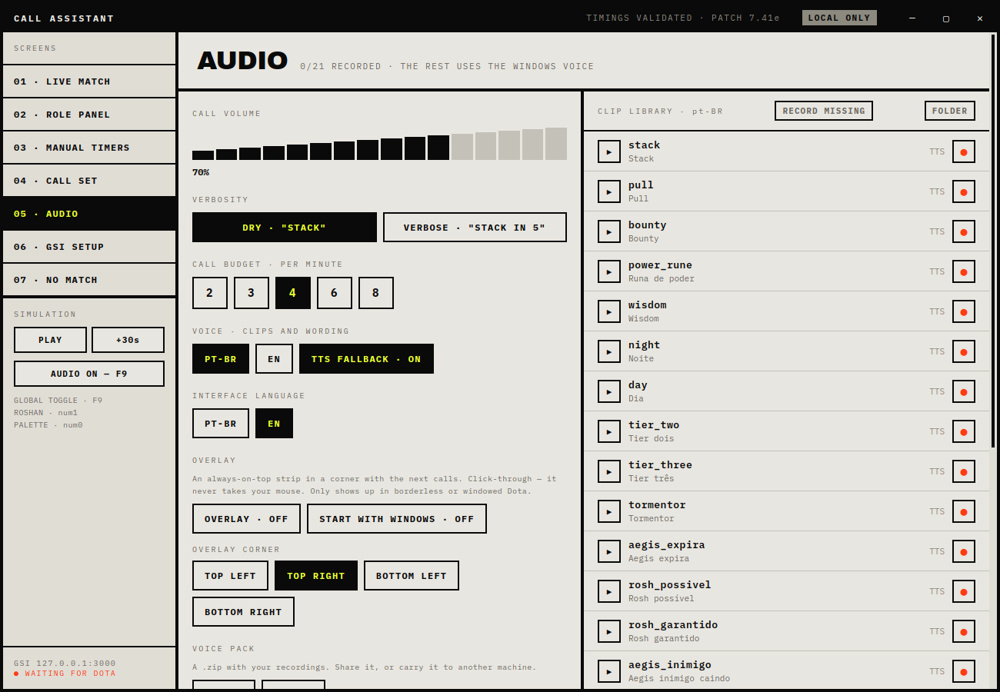
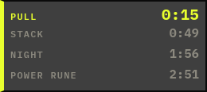

# Call Assistant

[Português](README.pt-BR.md) · **English**

A voice call assistant for Dota 2. Electron, Windows.

It reads the match clock through Valve's official **Game State Integration**
and speaks the timings for your role — stacks, pulls, runes, day/night,
neutrals, Tormentor, the Roshan chain — **in your own voice**, recorded by you
inside the app.

Nothing leaves the machine: no account, no telemetry, no network. The hotkeys
only listen to your keyboard; nothing is ever sent to the game.



---

## Will I get banned?

The honest answer first: nobody but Valve can speak for Valve, and this project
comes with no warranty. What it can do is tell you exactly what it touches, so
you can judge for yourself.

**It reads one thing: the JSON that Dota itself sends.** Game State Integration
is an official Valve feature, shipped with the game, documented by Valve, and
switched on by a launch option Valve provides — `-gamestateintegration`. Dota
posts a snapshot of your own match to a local address a few times a second.
This app listens on `127.0.0.1:3000` and reads it. That is the whole
integration. It is the same mechanism behind the stream overlays you see on
every official broadcast.

**What it never does**, and what would actually be over the line:

- It does not read or write the game's memory, and does not attach to,
  inject into or hook the Dota process.
- It does not send input to the game. The global hotkeys use the operating
  system's own shortcut registration to *listen*; nothing is ever typed,
  clicked or scripted into Dota.
- It does not modify any game file. The one file it writes is the GSI config
  Valve's own feature reads, in the folder Valve created for it.
- It does not read chat, other players, fog of war, or anything you cannot
  already see on your own screen.

**Everything it says, you could have said yourself** with a stopwatch. The
stack is at :53 whether or not anything reminds you. The app is a timer that
talks — it does not give you information the game was hiding.

It also never talks to the network: no account, no telemetry, no update ping
while you play. The one place your data goes is `%APPDATA%`, on your machine.

---

## Download (no terminal needed)

If you just want to use it and never touch code:

1. Go to the [**Releases**](../../releases) page.
2. Download `CallAssistant-<version>-x64.exe` — the installer — or the
   portable build if you would rather not install anything.
3. Run it. Windows SmartScreen will warn you that the publisher is unknown,
   because the build is not code-signed (a certificate costs money this
   project does not have). Click **More info** → **Run anyway**, or check the
   build yourself: every release is produced by GitHub Actions from the source
   in this repository, and the log is public.
4. Open the app, go to `06 · GSI SETUP` and follow the three steps there.

Everything below this point is for people who want to run it from source.

---

## Requirements

- Windows 10 or 11
- [Node.js LTS](https://nodejs.org) (to run or build it; the installer does not need it)
- Dota 2 installed through Steam

## Run

```bash
npm install
npm start
```

## Build the installer

```bash
npm run dist
```

Output lands in `release/`: an NSIS installer and a portable `.exe`, both x64.

Run it **on Windows**. From Linux or WSL, `electron-builder` packages the app
fine (`release/win-unpacked/` is already usable) but fails on the last step,
where `rcedit` stamps the icon and metadata into the `.exe` — that needs Wine.
On Windows there is no such intermediate step.

Other commands:

| Command | What it does |
| --- | --- |
| `npm run dev` | Runs with DevTools open |
| `npm run watch` | Rebuilds on change (run `npx electron .` in another terminal) |
| `npm run typecheck` | `tsc --noEmit` over the main process and the renderer |
| `npm test` | Call engine tests (no build step, no dependency) |
| `npm run pack` | Packages without producing an installer |

---

## Languages

Two separate settings, on the `05 · AUDIO` screen:

- **Voice** — which clip folder is used and which wording is spoken (`pt-BR`, `en`)
- **Interface** — the language of the UI (`pt-BR`, `en`)

They are independent on purpose: wanting the interface in English while the
calls come out in Portuguese is a normal thing to want. On first launch the app
follows your system language.

### Adding a language

Everything lives in [`src/shared/i18n.ts`](src/shared/i18n.ts). The `en` object
is the source of truth for the types: add your language to `UiLanguage` and to
`MESSAGES`, and `tsc` will name every key you are still missing, one by one. No
interface string is scattered through the code.

A new **voice** is a different job, in `src/shared/catalog.ts`: each event
carries its own `text` with a short and a long form per locale.

---

## Connecting to Dota (the `06 · GSI SETUP` screen)

1. **WRITE CONFIG** — the app finds your Dota folder through the Steam registry
   and writes `gamestate_integration_callassistant.cfg`. If it cannot find it,
   use **CHOOSE FOLDER** and point at `.../steamapps/common/dota 2 beta`.
2. **Add `-gamestateintegration`** to Dota 2's launch options in Steam. The
   **COPY** button puts it on your clipboard — the app cannot do this for you,
   Steam exposes no way to.
3. **Restart Dota.** It only reads GSI files at startup.

The screen shows the raw payload arriving, so you can tell immediately whether
it worked.



---

## Recording your own calls (the `05 · AUDIO` screen)

Every call has a clip. Where no recording exists, the app falls back to the
Windows voice (TTS) — so it is usable without recording anything.

- **●** next to a call opens the recorder with the line on screen.
- **RECORD MISSING** walks a queue of everything that has no clip yet.
- In the recorder: `space` records and stops, `enter` saves, `esc` closes.

Each take is trimmed at the silence on both ends and peak-normalised before it
is saved, so the call lands the instant it fires and every clip sits at the
same volume.

Clips are mono WAV, one folder per locale:

```
%APPDATA%\Call Assistant\recordings\pt-BR\stack.wav
```

The **FOLDER** button opens that directory. You can swap the files by hand, as
long as you keep the name (`<id>.wav`).



---

## Overlay, tray and start with Windows

All on `05 · AUDIO`, all **off by default**.

The **overlay** is a 320×64 strip at the top of the screen showing the next
call and its countdown. It is click-through, stays out of Alt+Tab and never
takes focus — the point is that you forget it is there. It only shows up with
Dota in windowed or borderless mode; in exclusive fullscreen Windows lets
nothing sit on top.



Calls collide — several are often due within the same few seconds — so the
strip lists the next four, soonest at the top in acid, the rest dimmed. Pick
which corner it sits in on the same screen.

Closing the window sends the app to the **tray**, where you can mute, toggle
the overlay and actually quit. **Start with Windows** brings it up already
tucked into the tray, with no window in your face.

---

## Voice packs

`05 · AUDIO` → **EXPORT** writes a `.zip` of your recordings; **IMPORT** reads
one. Use it to carry your voice to another machine — or to let someone else
download yours and use it instead of the Windows voice.

The reader treats the file as hostile: it verifies the CRC and declared size of
every entry, rejects any name carrying a path (`../`, `/`, a subfolder), skips
unknown clip ids, and caps entries at 8 MB. A `.zip` off the internet is not to
be trusted.

---

## Global hotkeys

They work with Dota focused. Remappable on `05 · AUDIO`.

| Default | Action |
| --- | --- |
| `F9` | Mute / unmute everything |
| `num1` | Mark Roshan (unrolls aegis → possible → guaranteed) |
| `num0` | Quick palette: two letters, dismisses itself |

Palette: `AE` enemy aegis · `GL` enemy glyph · `BB` enemy buyback ·
`SM` smoke spotted.

---

## How the app decides what to say

One call per second, at most. When two land together the higher priority speaks
and the other is logged as `DROPPED` — the log shows everything that was
considered, spoken or not, so the silence is explainable.

What silences a call, in order:

| State | Effect |
| --- | --- |
| Global mute (`F9`) | silences everything |
| Game paused | silences everything |
| You are dead | silences everything except the Roshan chain |
| **FIGHT** toggled on | priority 5 only |
| Per-minute budget spent | priority 4+ only |

The budget (2 to 8 calls per minute) is what keeps it from turning into talk
radio. Default: 4.

The `04 · CALL SET` screen shows the set for your role and lets you silence
individual events.

### Timings (patch 7.41e)

| Call | When | Lead |
| --- | --- | --- |
| Stack | :53 of every minute, 1:53–30:00 | 10s |
| Pull | :15 of every minute, 1:00–15:00 | 6s |
| Bounty | every 3:00 | 10s |
| Power rune | every 2:00, from 6:00 | 15s |
| Wisdom | every 7:00 | 20s |
| Night / Day | 5:00 and 10:00, alternating | 10s |
| Neutral tier 2 / tier 3 | 17:30 / 27:30 | 10s |
| Tormentor | 20:00 | 30s |
| Aegis expires / Rosh possible / guaranteed | +5:00 / +8:00 / +11:00 from the mark | 10s |

Four more calls come from **state** rather than the clock: **no buyback**
(after 20:00, alive, gold below the cost), **no TP** (after 2:00), **ultimate
ready** and **item ready**. The last two speak only on the cooldown-to-ready
transition, and only when the wait was worth mentioning — 30s for the
ultimate, 12s for items, otherwise blink and force staff would never get a
word in.

---

## Without Dota running

The **SIMULATION** panel in the sidebar runs a fake clock: `PLAY` moves in real
time, `+30s` skips ahead. Good for checking the calls and testing your
recordings without queueing for a match.

---

## Layout

```
src/
  shared/      event and clip catalogue, interface strings, IPC types
  main/        main process: GSI server, hotkeys, Dota config, files
  preload/     IPC bridge (contextIsolation on)
  renderer/    call engine, audio, recorder, overlay and the 7 screens
tests/         engine tests, plain node:test
build.mjs      esbuild: bundles + static files
```

The renderer uses no framework: plain DOM, rebuilt every tick.

---

## Known limitations

- GSI reports neither your ward stock in the shop nor enemy positions. The
  discipline panel only sees what is in your inventory.
- Roshan and the palette timers are manual today. GSI does carry an `events`
  stream of chat-message events, so some of these may turn out to be
  detectable — only item purchases have been observed so far, in a hero demo.
  `tools/gsi-probe.mjs` is there to settle it against a real match.
- The overlay does not show with Dota in exclusive fullscreen. Use windowed or
  borderless, or just leave it off — the app is built to be heard, not looked
  at, during a match.
- Ultimate and item cooldowns need `abilities` in the GSI config. If you set
  yours up before this version, hit **WRITE CONFIG** again and restart Dota.
